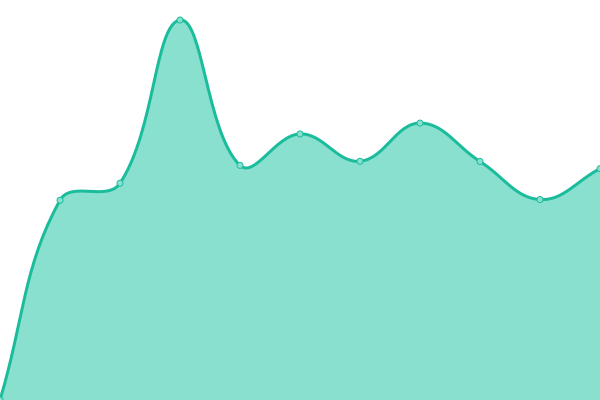
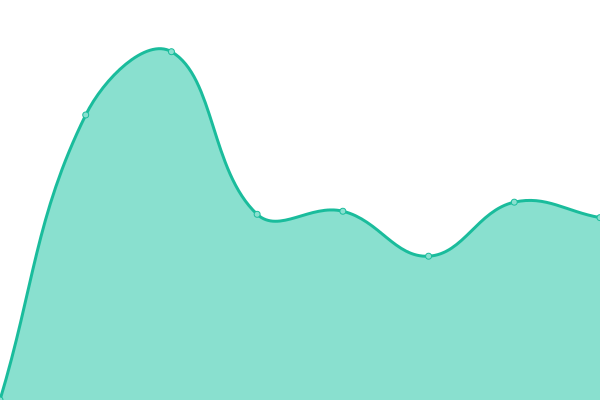
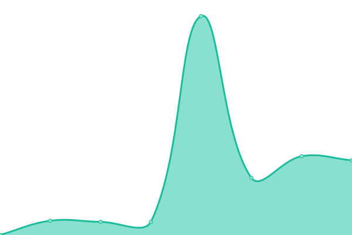
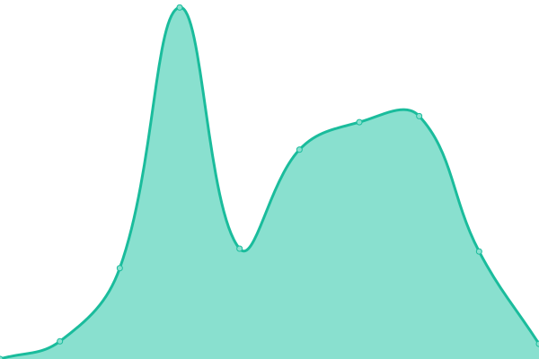
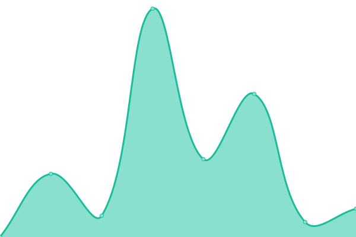
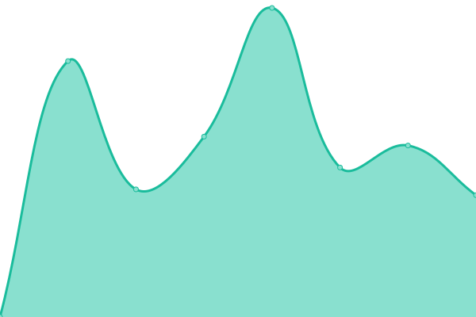
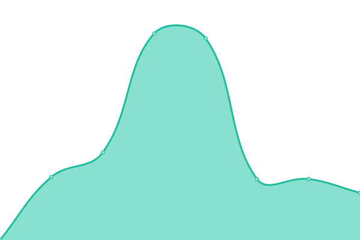
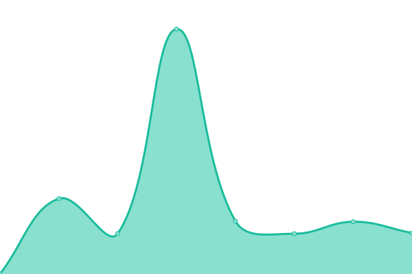
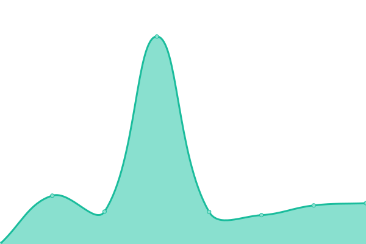

# [📈 Live Status](https://tmkhiem.github.io/hcmums-web-uptime): <!--live status--> **🟧 Partial outage**

This repository contains the open-source uptime monitor and status page for [Mai-Khiem TRAN](https://tmkhiem.github.io/hcmums-web-uptime), powered by [Upptime](https://github.com/upptime/upptime).

With [Upptime](https://upptime.js.org), you can get your own unlimited and free uptime monitor and status page, powered entirely by a GitHub repository. We use [Issues](https://github.com/tmkhiem/hcmums-web-uptime/issues) as incident reports, [Actions](https://github.com/tmkhiem/hcmums-web-uptime/actions) as uptime monitors, and [Pages](https://tmkhiem.github.io/hcmums-web-uptime) for the status page.

<!--start: status pages-->
<!-- This summary is generated by Upptime (https://github.com/upptime/upptime) -->
<!-- Do not edit this manually, your changes will be overwritten -->
<!-- prettier-ignore -->
| URL | Status | History | Response Time | Uptime |
| --- | ------ | ------- | ------------- | ------ |
|  [Homepage](https://hcmus.edu.vn/) | 🟩 Up | [homepage.yml](https://github.com/tmkhiem/hcmus-web-uptime/commits/HEAD/history/homepage.yml) | 

 2907ms
     
 | 

<a href="https://tmkhiem.github.io/hcmus-web-uptime/history/homepage">99.52%</a>
    

|  [Portal](https://portal.hcmus.edu.vn/) | 🟩 Up | [portal.yml](https://github.com/tmkhiem/hcmus-web-uptime/commits/HEAD/history/portal.yml) | 

 5070ms
     
 | 

<a href="https://tmkhiem.github.io/hcmus-web-uptime/history/portal">99.33%</a>
    

|  [Portal 1](https://portal1.hcmus.edu.vn/) | 🟩 Up | [portal-1.yml](https://github.com/tmkhiem/hcmus-web-uptime/commits/HEAD/history/portal-1.yml) | 

 2017ms
     
 | 

<a href="https://tmkhiem.github.io/hcmus-web-uptime/history/portal-1">99.34%</a>
    

|  [Portal 2](https://portal2.hcmus.edu.vn/) | 🟩 Up | [portal-2.yml](https://github.com/tmkhiem/hcmus-web-uptime/commits/HEAD/history/portal-2.yml) | 

 1599ms
     
 | 

<a href="https://tmkhiem.github.io/hcmus-web-uptime/history/portal-2">99.34%</a>
    

|  [Portal 3](https://portal3.hcmus.edu.vn/) | 🟩 Up | [portal-3.yml](https://github.com/tmkhiem/hcmus-web-uptime/commits/HEAD/history/portal-3.yml) | 

 1671ms
     
 | 

<a href="https://tmkhiem.github.io/hcmus-web-uptime/history/portal-3">99.35%</a>
    

|  [Portal 4](https://portal4.hcmus.edu.vn/) | 🟩 Up | [portal-4.yml](https://github.com/tmkhiem/hcmus-web-uptime/commits/HEAD/history/portal-4.yml) | 

 2119ms
     
 | 

<a href="https://tmkhiem.github.io/hcmus-web-uptime/history/portal-4">99.35%</a>
    

|  [Portal 5](https://portal5.hcmus.edu.vn/) | 🟩 Up | [portal-5.yml](https://github.com/tmkhiem/hcmus-web-uptime/commits/HEAD/history/portal-5.yml) | 

 1467ms
     
 | 

<a href="https://tmkhiem.github.io/hcmus-web-uptime/history/portal-5">99.36%</a>
    

|  [Portal 6](https://portal6.hcmus.edu.vn/) | 🟩 Up | [portal-6.yml](https://github.com/tmkhiem/hcmus-web-uptime/commits/HEAD/history/portal-6.yml) | 

 1632ms
     
 | 

<a href="https://tmkhiem.github.io/hcmus-web-uptime/history/portal-6">99.37%</a>
    

|  [HR](https://hr.hcmus.edu.vn/) | 🟥 Down | [hr.yml](https://github.com/tmkhiem/hcmus-web-uptime/commits/HEAD/history/hr.yml) | 

 0ms
     
 | 

<a href="https://tmkhiem.github.io/hcmus-web-uptime/history/hr">0.00%</a>
    

|  [Support](https://support.hcmus.edu.vn/) | 🟩 Up | [support.yml](https://github.com/tmkhiem/hcmus-web-uptime/commits/HEAD/history/support.yml) | 

 934ms
     
 | 

<a href="https://tmkhiem.github.io/hcmus-web-uptime/history/support">100.00%</a>
    

|  [Student](https://student.hcmus.edu.vn/) | 🟩 Up | [student.yml](https://github.com/tmkhiem/hcmus-web-uptime/commits/HEAD/history/student.yml) | 

 1089ms
     
 | 

<a href="https://tmkhiem.github.io/hcmus-web-uptime/history/student">100.00%</a>
    

|  [Dspace](https://dspace.hcmus.edu.vn/) | 🟥 Down | [dspace.yml](https://github.com/tmkhiem/hcmus-web-uptime/commits/HEAD/history/dspace.yml) | 

 0ms
     
 | 

<a href="https://tmkhiem.github.io/hcmus-web-uptime/history/dspace">0.00%</a>
    

<!--end: status pages-->

[**Visit our status website →**](https://tmkhiem.github.io/hcmums-web-uptime)

## 📄 License

- Powered by: [Upptime](https://github.com/upptime/upptime)
- Code: [MIT](./LICENSE) © [Mai-Khiem TRAN](https://tmkhiem.github.io/hcmums-web-uptime)
- Data in the `./history` directory: [Open Database License](https://opendatacommons.org/licenses/odbl/1-0/)
